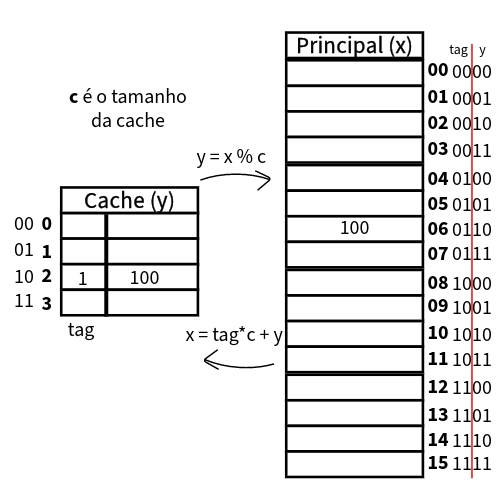

[Voltar à página inicial](../README.md#sumário)
# Hierarquia de Memória
No computador, a memória é responsável pelo armazenamento de dados e programas, e deve atender demandas do processador.

O acesso à memória é a etapa mais lenta no processamento, comprometendo o desempenho do computador como um todo.

Tecnologias de memória têm sido alvo de constante pesquisa e desenvolvimento tecnológico, entretanto novas tecnologias costumam possuir um custo muito alto, o que compromete seu uso em computadores pessoais.

Para obter um **trade-off** entre custo e desempenho, o sistema de memória é organizado de maneira hierárquica.

Essa organização hierárquica consiste no emprego de tecnologias da seguinte forma:
- quanto mais rápida, mais próxima do processador e menor a quantidade (para diminuir o custo)

Desta forma, os dados são armazenados no nível mais baixo, e trafegam somente entre níveis adjacentes conforme demanda do processaor. Para otimizar este tráfego, o armazenamento e lógica de requisições, seguem duas premissas chamadas **princípios de localidade**:
1. **localidade temporal**: um dado requisitado tende a ser requisitado novamente
2. **localidade espacial**: se um dado foi requisitado, dados em sua vizinhança tendem a ser requisitados

Quando o processador requisita um dado, se ele estiver no nível 1, dizemos que houve um **acerto**. Caso contrário, dizemos que houve uma **falha**. 

A **taxa de acerto (falha)** é a quantidade relativa de requisições que resultaram em **acerto (falha)**.

A **penalidade de falha** é o tempo que o sistema de memória demora para carregar o dado no nível 1. O objetivo da organização hierárquica é minimizar a taxa

Em um computador genérico:
- nível 1 é a memória cache
- nível 2 é a memória ram
- nível 3 é o disco (HD, SSD, etc)

## Memória Cache
Quando o processador requisita um dado, ele referencia um endereço de memória do dado que dizemos endereço da **memória principal**. A memória principal é uma abstração oferecida pelo sistema operacional (pode ser a RAM, a RAM + disco, a RAM + swap, etc).

A ideia da memória cache é armazenar cópias dos dados da memória principal de forma a **minimizar a taxa de falhas** atendendo da melhor forma os princípios de localidade.

### Mapeamento direto
O mapeamento direto é a forma mais simples de implementar uma memória cache. Neste tipo de mapeamento, cada endereço da memória principal é mapeado em um endereço da memória cache.
